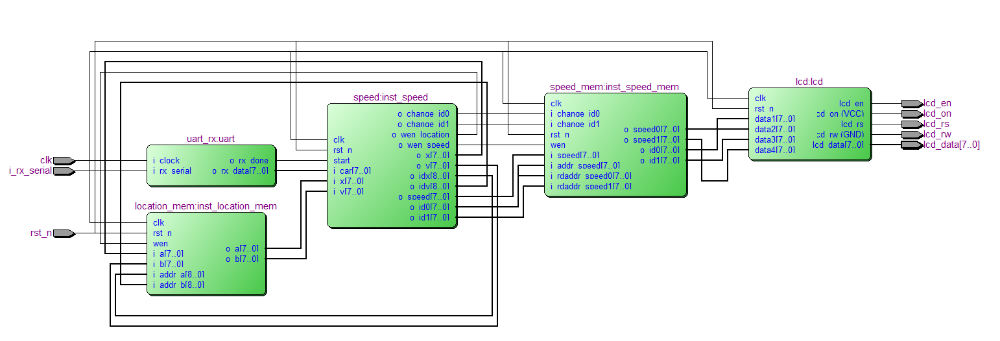

# Speed_Detection

## Project Overview

This project aims to design and implement a IP that caculate speed of cars in realtime using Verilog and implemete on FPGA platform.

## Table of Contents
- [Project Overview](#project-overview)
- [Features](#features)
- [Usage](#usage)
- [Block Diagram](#block-diagram)
- [Testing](#testing)
- [Background](#background)

## Features

- **Tracking cars using Python**: Using python for detecting and tracking cars realtime.
- **Sending messages through UART interface**: After detecting cars on python, it will send car's information (location, id) to FPGA board using UART interface.
- **Design RTL and functional unit that handle all messages and measure accurate  speed of sent cars**.
- **Simulation and testing environment**: Verification by implementing on DE2 Altera board.

## Usage

To run this work, you will need a verilog compiler such as ncverilog, Vivado, Quartus.
As a university Project, I used Quartus and implemented it on DE2-board for verification.

## Block Diagram

## Testing

Verification on DE2 Altera Board:

## Background

This is originally a course project at University of Information and Technology.

The design works successfully on DE2-board, there still exists several issues:

Sometimes, a speed of some cars were inaccurate. I had to overcome the difference between 2D image and 3D highway. In addition, the resolution of video I used from beginning was
low and the tool tracking cars in python also not perform well.

This design can still be improved by upgrading video resolution, hardware resources and more accurate tracking tool.

